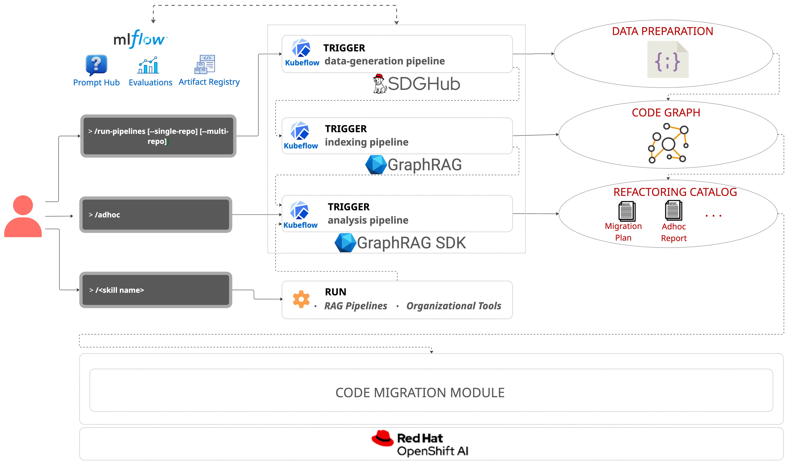
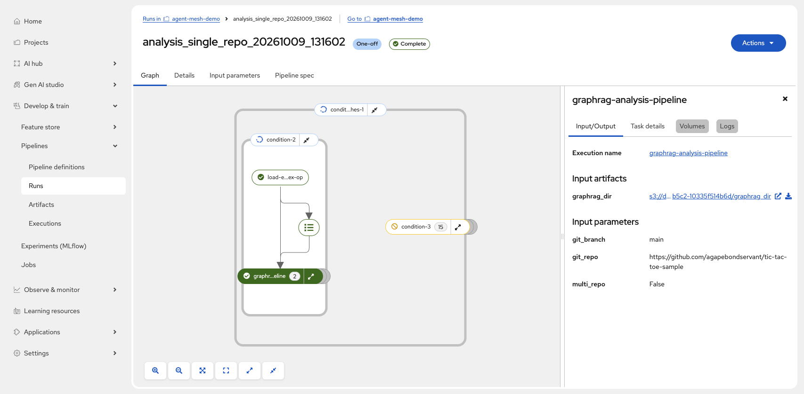
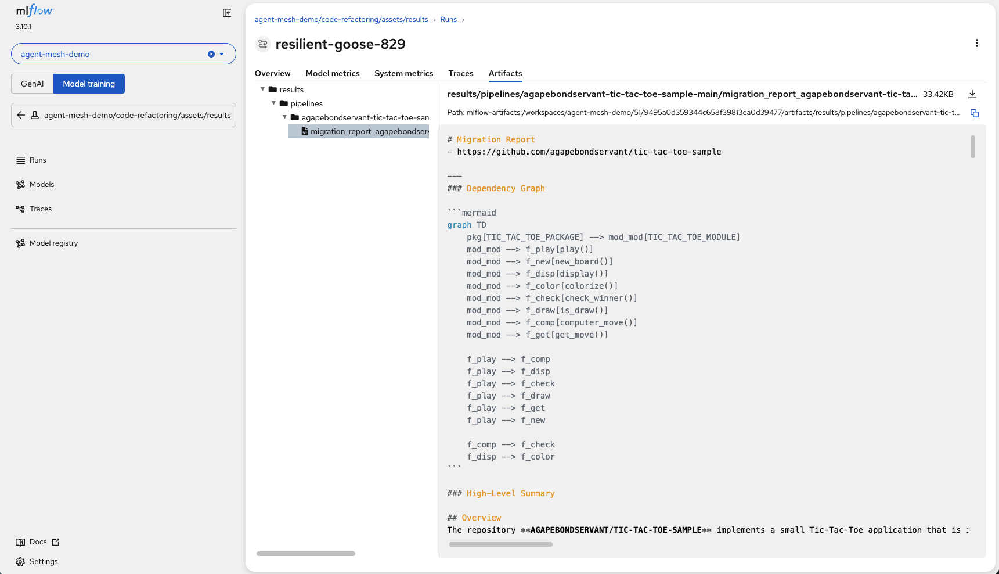
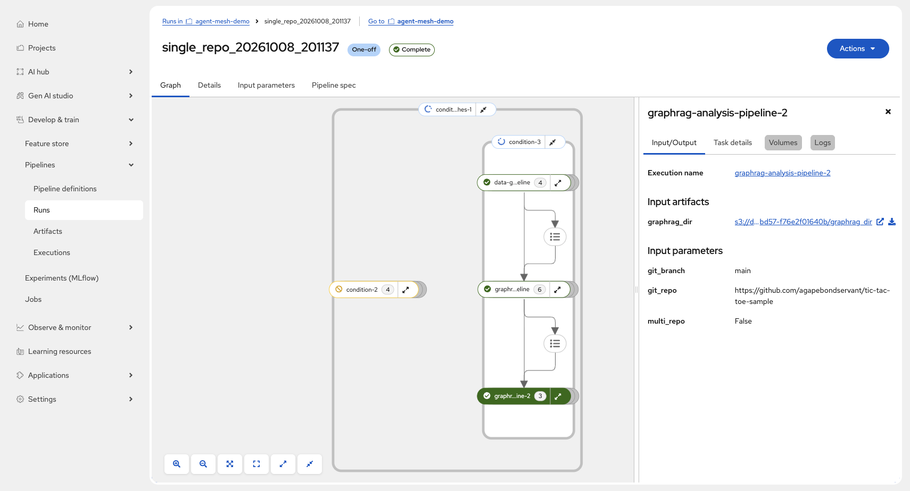
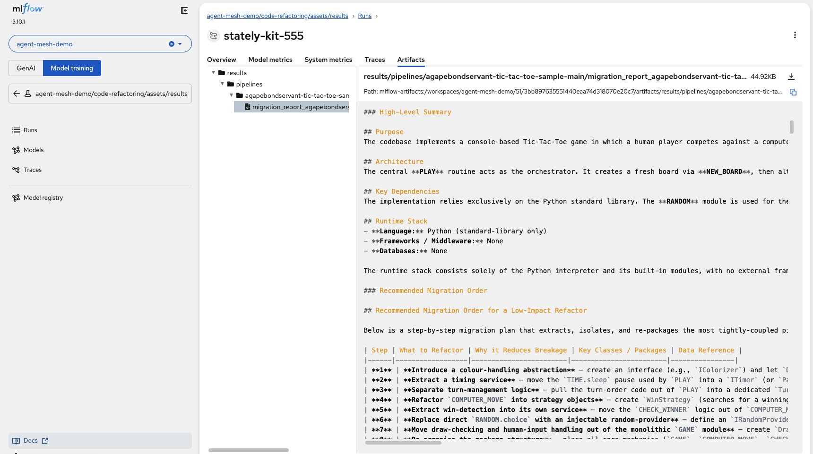
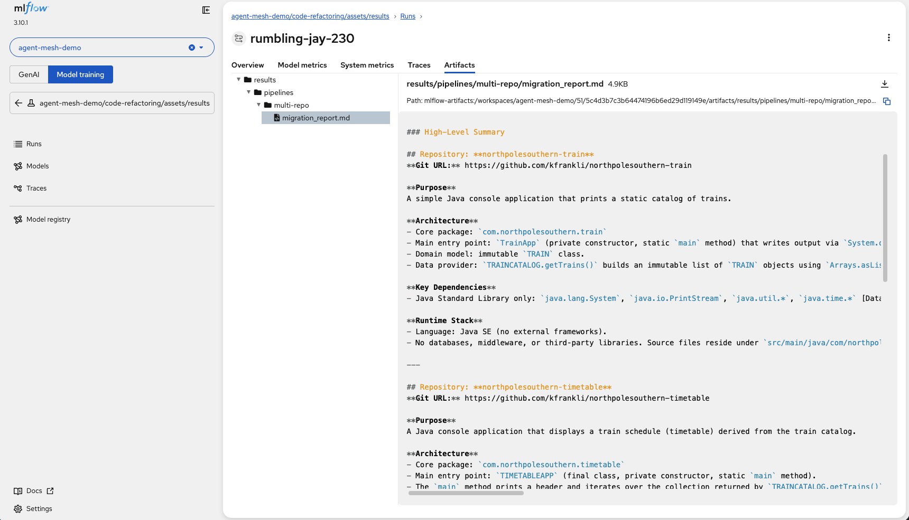

# Modernize Legacy Applications with Agentic Code Understanding

Analyze legacy code with GraphRAG on Red Hat OpenShift AI to uncover dependencies, ask questions about the codebase, and plan a safer migration.

## Table of contents

- [Detailed description](#detailed-description)
  - [Who is this for?](#who-is-this-for)
  - [Why code understanding matters for modernization](#why-code-understanding-matters-for-modernization)
  - [What this quickstart provides](#what-this-quickstart-provides)
  - [What you'll do](#what-youll-do)
  - [Architecture diagrams](#architecture-diagrams)
- [Requirements](#requirements)
  - [Minimum hardware requirements](#minimum-hardware-requirements)
  - [Minimum software requirements](#minimum-software-requirements)
  - [Required user permissions](#required-user-permissions)
- [Deploy](#deploy)
  - [1. Clone the repository](#1-clone-the-repository)
  - [2. Prepare the model endpoints](#2-prepare-the-model-endpoints)
  - [3. Configure the environment](#3-configure-the-environment)
  - [4. Install on OpenShift AI](#4-install-on-openshift-ai)
  - [5. Ask a question using the prebuilt index](#5-ask-a-question-using-the-prebuilt-index)
  - [6. Generate a migration report using the prebuilt index](#6-generate-a-migration-report-using-the-prebuilt-index)
  - [7. Run your first code analysis](#7-run-your-first-code-analysis)
    - [7.1 Analyze the sample repository](#71-analyze-the-sample-repository)
    - [7.2 Review the modernization results](#72-review-the-modernization-results)
    - [7.3 Ask questions about the code](#73-ask-questions-about-the-code)
  - [8. Analyze multiple repositories](#8-analyze-multiple-repositories)
  - [9. Analyze your own repositories](#9-analyze-your-own-repositories)
  - [10. Explore the optional console](#10-explore-the-optional-console)
  - [11. What you've accomplished](#11-what-youve-accomplished)
  - [12. Delete](#12-delete)
- [Reference](#reference)
  - [How the workflow works](#how-the-workflow-works)
  - [Configuration variables](#configuration-variables)
  - [Add external analysis metadata](#add-external-analysis-metadata)
  - [Build container images](#build-container-images)
  - [Further reading](#further-reading)
- [Tags](#tags)


## Detailed description

Modernizing an unfamiliar application starts with understanding its structure.
Teams need to know which modules depend on one another, where important data
flows, and which changes could affect other parts of the system. This
quickstart analyzes a source repository and produces a code graph and migration
report that teams can review before planning changes.

The Code Understanding workflow is the first phase of Agent Mesh for Software
Modernization. It prepares repository data, indexes the code with GraphRAG, and
uses that index to generate a report and answer follow-up questions. The
separate Code Migration workflow is outside the scope of this repository.

### Who is this for?

- Application architects assessing a legacy system before modernization.
- Development teams taking ownership of an unfamiliar codebase.
- Platform and AI teams evaluating code analysis on Red Hat OpenShift AI.

You do not need to understand GraphRAG internals to follow the walkthrough.
You do need access to an OpenShift AI project and the model endpoints listed
below.

### Why code understanding matters for modernization

A legacy codebase contains deeply intertwined dependencies, hidden data flows, and architectural coupling that are difficult to uncover file-by-file. Migrating a component without that structural context introduces high regression risks and costly rework.

#### Why GraphRAG?

Standard vector search (RAG) finds code snippets based on keyword or semantic similarity, but it misses global relationships across hundreds of modules. **GraphRAG combines knowledge graphs with LLMs** to map the entire repository's architecture. This allows the workflow to:

- **Trace structural dependencies:** Map how functions, classes, and services connect across distinct files.
- **Understand global context:** Answer architectural questions (e.g., *"Which components depend on this legacy data store?"*) that vector search alone cannot resolve.
- **Identify logical migration boundaries:** Highlight tightly coupled modules that should be refactored together.

Treat the generated migration report and GraphRAG answers as evidence for planning: review findings against source code and organizational constraints before making production changes.

### What this quickstart provides

- OpenShift AI pipelines for data generation, GraphRAG indexing, and analysis.
- A Markdown migration report produced by the analysis pipeline.
- A command-line query wrapper for questions about an indexed repository.
- A prebuilt index for the sample Tic-Tac-Toe repository, uploaded by the
default MLflow-backed installation.
- An optional web console for selecting repositories, starting runs, viewing
reports, and asking questions.
- Helm and Make targets for installation, verification, and cleanup.


### What you'll do

In this quickstart, you will deploy the workflow, ask a question using the
uploaded sample index, then analyze that repository and inspect its migration
report.
You can then repeat the process with your own repository or a list of
repositories. The console and observability components are optional.

### Architecture diagrams



The architecture illustrates the path from raw source code through automated data preparation, GraphRAG indexing, and final migration report generation. Each of these steps is a Kubeflow pipeline component running sequentially within Red Hat OpenShift AI.

## Requirements


### Minimum hardware requirements


| Resource           | Minimum or example                                                  | Used for                                          |
| ------------------ | ------------------------------------------------------------------- | ------------------------------------------------- |
| CPU and memory     | 8+ vCPUs and 24+ GiB RAM                                            | Quickstart workloads, separate from model serving |
| Persistent storage | Default `StorageClass` able to provision a 50 GiB ReadWriteOnce PVC | S4-backed S3-compatible object storage            |
| NVIDIA L40S GPU    | 1, if hosting the example `gpt-oss-120b` endpoint                   | GraphRAG chat model                               |
| NVIDIA L40S GPU    | 1, if hosting the example `e5-mistral-7b-instruct` endpoint         | Embedding model                                   |


If you use existing OpenAI-compatible model endpoints, their GPUs do not need
to be part of the Quickstart cluster.

### Minimum software requirements

- Red Hat OpenShift 4.18+ (OpenShift 4.21+ for the optional UI add-ons).
- Red Hat OpenShift AI 3.4+.
- MLflow (the integration assumes OpenShift AI 3.4+). [Installation](https://docs.redhat.com/en/documentation/red_hat_openshift_ai_self-managed/3.4/html/working_with_mlflow/installing-mlflow_mlflow)
- OpenShift AI Pipelines. [Installation](https://docs.redhat.com/en/documentation/red_hat_openshift_ai_self-managed/3.5/html/openshift_ai_tutorial_-_fraud_detection_example/setting-up-a-project-and-storage#enabling-ai-pipelines)
- OpenShift CLI (`oc`). [Installation](https://docs.redhat.com/en/documentation/openshift_container_platform/4.22/html/cli_tools/openshift-cli-oc)
- Helm CLI (`helm`). [Installation](https://helm.sh/docs/intro/install/)
- Make (`make`). [Download and installation](https://www.gnu.org/software/make/)
- `jq` CLI (`jq`). [Download and installation](https://jqlang.org/download/)
- `uv` CLI (`uv`). [Installation](https://docs.astral.sh/uv/getting-started/installation/)
- **Optional:** Red Hat build of OpenTelemetry Operator. [Installation](https://docs.redhat.com/en/documentation/openshift_container_platform/4.18/html/distributed_tracing/distributed-tracing-otel-install)
- **Optional:** Tempo Operator. [Installation](https://docs.redhat.com/en/documentation/openshift_container_platform/4.18/html/distributed_tracing/distributed-tracing-tempo-install)


### Required user permissions

The installer requires permission to manage workloads and resources in the
target project. By default, `make install` also creates the target namespace
and applies the OpenShift AI dashboard label and requester annotation. If an
administrator pre-creates and configures the namespace, run
`make install MANAGE_NAMESPACE=false` to skip those cluster-scoped namespace
operations. The target namespace must already exist and have the
`opendatahub.io/dashboard: "true"` label. If OpenTelemetry is enabled in a
separate namespace, that namespace must also be pre-created.

Workbench ImageStreams are created in the target project and need permission
to manage resources there. Optional OpenTelemetry deployment and the OpenShift
console plugin have additional cluster-scoped requirements; use cluster-admin
or equivalent delegated permissions for those features.

## Deploy

Follow the steps in order. The first run uses the public sample repository so
you can see the complete analysis before pointing the workflow at your own code.

### 1. Clone the repository

```sh
git clone https://github.com/rh-ai-quickstart/agent-mesh-for-sw-modernization.git
cd agent-mesh-for-sw-modernization
```

Run the remaining commands from this directory. Log in to OpenShift using the
login command provided by your cluster's web console before installing.

### 2. Prepare the model endpoints

Provide reachable OpenAI-compatible endpoints for the chat and embedding
roles. These model guides show example deployments:


| Role                | Example                  | Guide                                                                              |
| ------------------- | ------------------------ | ---------------------------------------------------------------------------------- |
| GraphRAG chat       | `gpt-oss-120b`           | [Deploy the chat model](resources/models/deploying-gpt-oss-120b.md)                |
| GraphRAG embeddings | `e5-mistral-7b-instruct` | [Deploy the embedding model](resources/models/deploying-e5-mistral-7b-instruct.md) |


You can have `make install` deploy the bundled embedding model instead of
supplying an external embedding endpoint.

### 3. Configure the environment

Copy the Make-compatible template and edit `.env`:

```sh
cp .env.template .env
```

Replace the template placeholders with real values. For this walkthrough, set
`GIT_REPO=https://github.com/agapebondservant/tic-tac-toe-sample` and
`GIT_BRANCH=main`. At the minimum, set:

- `KFP_NAMESPACE` to the target data science project.
- `AWS_ACCESS_KEY_ID`, `AWS_SECRET_ACCESS_KEY`, and optionally `AWS_S3_BUCKET`.
- `GRAPHRAG_LLM_*` values for the chat endpoint.
- `EMBED_LLM_*` values for the embedding endpoint. This can be omitted when installing the bundled local model with `DEPLOY_EMBEDDING_MODEL=true`.
- `GIT_USERNAME` and `GIT_TOKEN` if the analyzed repository or the Quickstart
source repository requires authentication.

See [Configuration variables](#configuration-variables) for the full list.

### 4. Install on OpenShift AI

Install the Helm release, register workbench images, upload the pipelines, and
load the sample index:

```sh
make install
```

To deploy the bundled
embedding model during installation, use this command instead:

```sh
make install DEPLOY_EMBEDDING_MODEL=true
```

OpenTelemetry and Tempo are optional and disabled by default. To deploy them as part of installation, run `make install DEPLOY_OTEL=true`.

### 5. Ask a question using the prebuilt index

The default installation uploads a prebuilt index for the sample Tic-Tac-Toe
repository. You can query it immediately, before running a pipeline:

```sh
wrappers/adhoc.sh \
    "What are the main modules in this repository?" \
    --git-repo https://github.com/agapebondservant/tic-tac-toe-sample \
    --git-branch main
```

The wrapper prints the answer when the query job completes.

### 6. Generate a migration report using the prebuilt index

You can generate a migration report from the same prebuilt Tic-Tac-Toe index
without running data generation or indexing. Submit the single-repository
pipeline with `--analysis-only`:

```sh
make run-pipelines ARGS="--single-repo --analysis-only" \
  PIPELINE_GIT_REPO=https://github.com/agapebondservant/tic-tac-toe-sample \
  PIPELINE_GIT_BRANCH=main
```

The command submits an analysis-only run and prints its run ID. In your
OpenShift AI project's **Develop & train > Pipelines > Runs** view, wait for
the run to succeed. This run skips data generation and indexing and uses the
existing index to produce the report.



Once the pipeline is marked as completed, you can open the completed run in MLflow and inspect the analysis
task's Markdown migration report.



Look for the components and dependencies it
identifies, then compare its suggested migration order with the sample source
code. The report is also available through the optional Code Understanding
console, where a completed run can be expanded and its analysis downloaded.

The report gives you a starting point for discussion, not an automatic code
change.

**Expected outcome:** a Markdown migration report is available without
rebuilding the prebuilt index.

### 7. Run your first code analysis


#### 7.1 Analyze the sample repository

To analyze the sample Tic-Tac-Toe repository from scratch, submit its
single-repository pipeline. This run generates data and builds a new index
before producing the migration report:

```sh
make run-pipelines ARGS="--single-repo" \
  PIPELINE_GIT_REPO=https://github.com/agapebondservant/tic-tac-toe-sample \
  PIPELINE_GIT_BRANCH=main
```

The command submits a run named `single_repo_<timestamp>` and prints its run
ID. Submission is not pipeline completion. In your OpenShift AI project's
Pipelines view, wait for that run to succeed before reviewing its report. You can find this by navigating to **Develop & train > Pipelines > Runs** in the Openshift AI console. 



This step can take a while. GraphRAG indexing is compute-intensive, and the
run time depends on the repository size and the resources available to the
pipeline.

**Expected outcome:** the run reaches **Complete** after data generation,
indexing, and analysis finish.

#### 7.2 Review the modernization results



Open the completed run in MLflow and inspect the analysis
task's Markdown migration report. It should look similar to the one generated by the analysis-only pipeline. If the run fails, inspect the failed pipeline task before moving to
the query step.

**Expected outcome:** a Markdown migration report is available for the sample
repository.

#### 7.3 Ask questions about the code

You can use the same command as earlier to ask additional questions targeting the index you just created:

```sh
wrappers/adhoc.sh \
  "Which components should we investigate first, and why?" \
  --git-repo https://github.com/agapebondservant/tic-tac-toe-sample \
  --git-branch main
```

The wrapper submits a query job and prints its answer when the job completes.
Try another question, such as which modules depend on a component you plan to
replace. Supplying `--git-repo` matters here: without it, the wrapper queries
a multi-repository index, which may not exist yet.

**Expected outcome:** the terminal prints an answer about the selected repository.

### 8. Analyze multiple repositories

You can run the same pipeline on multiple repositories to build a combined
index and compare dependencies that may affect migration order.

The checked-in [repo_list.json](workflows/examples/code_understanding/assets/repos/repo_list.json)
contains two related Java applications: [North Pole Southern Train](https://github.com/kfrankli/northpolesouthern-train)
and [North Pole Southern Timetable](https://github.com/kfrankli/northpolesouthern-timetable).
Each entry has a `git_repo` URL and a `git_branch` value. Apply this list and
submit the multi-repository pipeline:

```sh
make apply-secrets
make run-pipelines ARGS="--multi-repo"
```

After the run succeeds, review its combined migration report in MLflow.



To ask a question across the combined index, omit the repository flags:

```sh
wrappers/adhoc.sh "Which repositories share dependencies that affect migration order?"
```


### 9. Analyze your own repositories

For a single-repository analysis, set `GIT_REPO` and `GIT_BRANCH` in `.env` to
your repository URL and branch. For a multi-repository analysis, edit
[repo_list.json](workflows/examples/code_understanding/assets/repos/repo_list.json).
If a repository is private, also set `GIT_USERNAME` and `GIT_TOKEN`.

Apply the updated settings and submit the appropriate run:

```sh
make apply-secrets
make run-pipelines ARGS="--single-repo" # use --multi-repo for a repository list
```

After the run succeeds, review its Markdown migration report. To query the
resulting index, use the single-repository command from section 7.3 or the
multi-repository command from section 8, depending on the run. The analysis
reads source code and does not modify your repositories.

### 10. Explore the optional console


#### 10.1 Deploying the console

The standalone Code Understanding console offers a visual way to select
repositories, start analysis, inspect reports, and ask questions. To deploy the application:

```sh
make deploy-console-app
```

The target prints its route. 

An OpenShift console plugin is also available for administrators. It requires
OpenShift 4.21 or later and cluster-wide console permissions. Deploy it with
`make deploy-console-plugin`; the target enables the plugin and prints its URL.

#### 10.2 Console overview


The **Repositories** tab shows a list of example repositories to run the analysis on. You can add your own using the input box on the bottom.

#### 10.3 Running analysis and viewing reports


On the left-hand side, you should be able to see the run you just completed under **Recent Runs**. Clicking on the report option will bring you to the **Analysis** tab and display the generated report. You can also use this tab to run analysis on the selected repositories in the **Repositories** tab.

#### 10.4 Chat interface


Navigating to the **Chat** tab will allow you to ask questions on repositories you have indexed to obtain GraphRAG-informed responses. Test it out with the sample queries provided, or you can bring in your own questions!

### 11. What you've accomplished

You have deployed the Code Understanding workflow, run its three pipeline
stages on a sample repository, examined a migration report, and asked a
follow-up question grounded in the indexed code. You can now analyze your own
repository or compare several repositories in one combined index.

### 12. Delete

When you have finished, run:

```sh
make uninstall
```

This removes the application Helm releases, pipeline and query jobs,
associated pipeline workflows, project workbench ImageStreams, application
secrets, and PVC-backed application data. The application and telemetry
namespaces remain. Externally stored MLflow data, externally pushed container
images, and the optional cluster-wide OpenShift console plugin also remain.

## Reference


### How the workflow works

1. **Data generation** collects relevant files from the chosen repository,
  converts them to text, and adds metadata for indexing.
2. **Data indexing** builds a GraphRAG representation of the prepared code.
3. **Data analysis** queries the index and writes a Markdown migration report.
  Ad hoc queries use that index for further investigation.

The workflow can use MLflow to store indexes and results and the shared
`aws-compatible-storage` chart (S4-backed) for S3-compatible storage. A
multi-repository run produces a combined index and report. OpenTelemetry and
Tempo can add tracing when enabled.

### Configuration variables

`.env.template` lists persistent settings. Make command-line assignments
override values in `.env`; the Makefile supplies defaults for some omitted
values.


| Variables                                                                                                                              | Purpose                                                          |
| -------------------------------------------------------------------------------------------------------------------------------------- | ---------------------------------------------------------------- |
| `AWS_ACCESS_KEY_ID`, `AWS_SECRET_ACCESS_KEY`, `AWS_S3_BUCKET`                                                                          | S4 credentials and application data bucket                       |
| `GIT_USERNAME`, `GIT_TOKEN`                                                                                                            | Credentials for private Git repositories                         |
| `GIT_REPO`, `GIT_BRANCH`, `GIT_REPO_LIST`                                                                                              | Single-repository source and multi-repository JSON list          |
| `GRAPHRAG_LLM_TOKEN`, `GRAPHRAG_LLM_ID`, `GRAPHRAG_LLM_API_BASE`, `GRAPHRAG_LLM_PROVIDER`, `GRAPHRAG_LLM_PROVIDER_SETTINGS_XML`        | Chat model credentials, endpoint, and GraphRAG provider settings |
| `EMBED_LLM_TOKEN`, `EMBED_LLM_ID`, `EMBED_LLM_API_BASE`, `EMBED_LLM_PROVIDER`, `EMBED_LLM_PROVIDER_SETTINGS_XML`                       | Embedding model credentials, endpoint, and provider settings     |
| `GROUND_TRUTH_LLM_TOKEN`, `GROUND_TRUTH_LLM_ID`, `GROUND_TRUTH_LLM_API_BASE`, `GROUND_TRUTH_LLM_PROVIDER`, `GROUND_TRUTH_LLM_THINKING` | Optional ground-truth evaluation model                           |
| `JUDGE_LLM_TOKEN`, `JUDGE_LLM_ID`, `JUDGE_LLM_API_BASE`, `JUDGE_LLM_PROVIDER`, `JUDGE_LLM_THINKING`                                    | Optional judge evaluation model                                  |
| `CODE_LLM_TOKEN`, `CODE_LLM_ID`, `CODE_LLM_API_BASE`, `CODE_LLM_PROVIDER`                                                              | Optional coding model                                            |
| `KFP_NAMESPACE`, `KFP_DATA_GENERATION_OUTPUT_PATH`, `KFP_DATA_INDEXING_OUTPUT_PATH`                                                    | Target project and pipeline data paths                           |
| `KFP_IMAGE_REGISTRY`                                                                                                                   | Registry for workflow and console images                         |
| `KFP_DATA_GENERATION_BASE_IMAGE_NAME`, `KFP_INDEXING_BASE_IMAGE_NAME`, `KFP_ANALYSIS_BASE_IMAGE_NAME`, `KFP_PIPELINE_TOOLS_IMAGE_NAME` | Pipeline image names                                             |
| `KFP_DATA_GENERATION_BASE_IMAGE_TAG`, `KFP_INDEXING_BASE_IMAGE_TAG`, `KFP_ANALYSIS_BASE_IMAGE_TAG`, `KFP_PIPELINE_TOOLS_IMAGE_TAG`     | Optional image tags; default to `BASE_VERSION`                   |
| `CONSOLE_APP_IMAGE_NAME`, `CONSOLE_PLUGIN_IMAGE_NAME`, `CONSOLE_IMAGE_TAG`                                                             | Optional console image names and tag                             |
| `MLFLOW_TRACKING_URI`, `MLFLOW_TRACKING_INSECURE_TLS`, `MLFLOW_TRACKING_AUTH`                                                          | MLflow endpoint, TLS setting, and authentication mode            |
| `ASSET_LOADER`, `INSTALL_PREBUILT_INDEX`, `CUSTOM_EVALUATOR`                                                                           | Asset backend, sample index upload, and evaluator                |
| `LOGLEVEL`                                                                                                                             | Application logging level                                        |
| `OTEL_SERVICE_NAME`, `OTEL_NAMESPACE`, `OTEL_EXPORTER_OTLP_ENDPOINT`, `OTEL_EXPORTER`                                                  | Optional tracing resources and exporter                          |
| `MLFLOW_TRACE_ENABLE_OTLP_DUAL_EXPORT`, `OTEL_SEMCONV_STABILITY_OPT_IN`                                                                | Optional trace export and semantic-convention settings           |


Useful Make overrides include `DEPLOY_EMBEDDING_MODEL`, `DEPLOY_OTEL`,
`WORKBENCH_IMAGESTREAM_NAMESPACE`, `PIPELINE_GIT_REPO`,
`PIPELINE_GIT_BRANCH`, and `PIPELINE_GIT_REPO_LIST`. Run `make help-all` for
their descriptions and other build and verification options.

### Add external analysis metadata

To enrich an analyzed repository with data from a vulnerability scanner,
dependency analyzer, or other tool, put its JSON output in a `.code_metadata`
directory at that repository's root. The data-generation stage merges those
files into its dataset before indexing. Each file must follow the
`[code_metadata_schema.json](workflows/examples/code_understanding/assets/schemas/code_metadata_schema.json)`
schema; fields that do not apply to a tool can be omitted.

### Build container images

Published images are used by default. If you change the application and need
your own images, set `KFP_IMAGE_REGISTRY` in `.env`, authenticate to that
registry, and build and push the images with Podman:

```sh
make build-images VERSION=dev
```

The target builds and pushes all workflow and console images. Set the matching
image tags in `.env` before deploying those images. Set
`CONTAINER_ENGINE=docker` to use Docker Buildx instead.

### Further reading

- [Red Hat OpenShift AI documentation](https://docs.redhat.com/en/documentation/red_hat_openshift_ai_self-managed/)
- [GraphRAG documentation](https://microsoft.github.io/graphrag/)
- [Kubeflow Pipelines documentation](https://www.kubeflow.org/docs/components/pipelines/)
- [MLflow documentation](https://mlflow.org/docs/latest/)


## Tags

- **Title:** Agent Mesh for Software Engineering - Code Understanding
- **Description:** Analyze legacy code with GraphRAG and generate an evidence-based modernization plan on Red Hat OpenShift AI.
- **Industry:** Cross-industry
- **Product:** Red Hat OpenShift AI
- **Use case:** Application modernization, code understanding, generative AI
- **Contributor organization:** Red Hat

